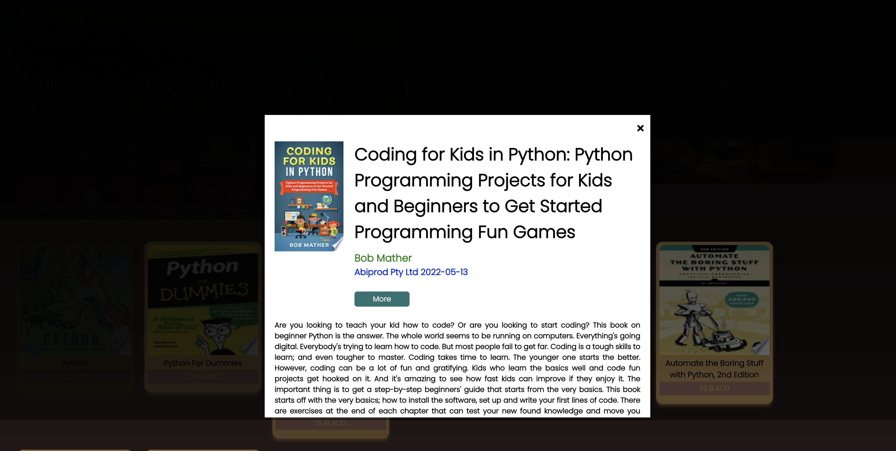

#  Andrea del Pilar Rivera Pena- React Task

[My Books site]( https://adorable-kangaroo-e933a4.netlify.app/)

### Content
For this project and followed a tutorial called Google Books API. This tutorial uses React to practice concepts such as State Hook, get data using Axios, and how to manage Google Books API to get the information for the book the user needs.
### Technical
The main features of this project are:

- [x] Banner displaying book images, and the title.
- [x] The search bar is where the user will type the book that is looking for.
- [x] Once the user presses the enter key, a list of books will be shown.
- [x] If the user clicks on a book from the list, a modal with more information will be displayed.
- [x] If the user clicks the "More" button, will be redirected to the Google API page.
- [x] Implements responsive design principles.

### Screenshots
>Banner Page

>List of Books

>Books Modal view.

>Books Summary

